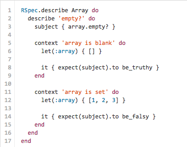

# Rspec とは

* ビヘイビア駆動開発(Behaviour Driven Development:BDD) を実現するためのテスティングフレームワーク。
* プログラムの振る舞いを記述するためのDSLを使用してテストコードを書いていく。

# ビヘイビア駆動開発とは

* プログラムの振る舞いを書き、それを仕様としてプログラム本体の実装をする開発手法のこと。

# DSL とは

* ドメイン特化言語(Domain Specific Language)。
* ある目的のために設計された言語。
* Rspec だとプログラムの振る舞いを記述するために設計された言語ということ。

# サンプル



# 基礎

## describe
* テストをグループ化する。
* テストする対象を表す。

## context
* テストを条件でグループ化する。
* テストする時の状況を表す。
* describe のエイリアス。

## it
* テストをexampleという単位にまとめる。
* it プロックの中に書かれた振る舞いへの期待を エクスペクテーション という。

## expect
* エクスペクテーション。
* expect(value).to eq(99) は「value が 99 であることを期待する」ということになる。

## before, before(:each)

* テスト前に行う処理を記述する。

## after, after(:each)

* テスト後に行う処理を記述する。

## before(:each), after(:each)

* グループのit 毎に実行される。

## before(:all), after(:all)

* グループ内で一度だけ実行される。

## let

* ブロックが返した値がシンボルと同名のローカル変数に格納される。
* 遅延評価される。(実際に呼び出しされるまでは実行されない)

## let!

* letと違って事前に評価される。

## subject

* テスト対象が明確になる。
* 第一引数を省略すると ``` let(:subject) {} ``` としたのと同じ。

# スタブ(stub)

* メソッドが呼び出された時に、特定の戻り値を返す。

# モック(mock)

* どのように呼び出されたか評価する。
* 期待されない呼び出しがされた場合はエラーが発生するのでモック自体がテストになる。

# テストダブル(double)

* テスト対象が依存しているリソースなどを置き換える代役のこと。
* テスト対象とは違うリソースに使うと良い。


# Ruby で Rspecを使う準備


```
$ mkdir spec-demo
$ cd spec-demo
$ bundle init
```

```ruby
# Gemfile

source 'https://rubygems.org'

gem 'rspec'
```

```
$ bundle install --path vendor/bundle
$ bundle exec rspec --init
```

```ruby
# spec/spec_helper.rb

# テスト対象のファイルを読み込む設定を追加する
Dir[File.join(File.dirname(__FILE__), "../lib/**/*.rb")].each { |f| require f }

RSpec.configure do |config|
...
end
```
